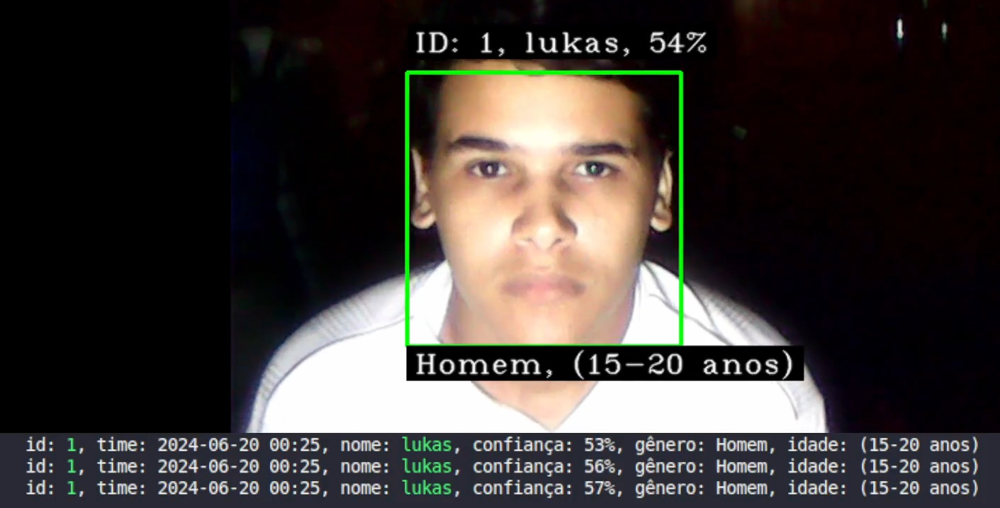
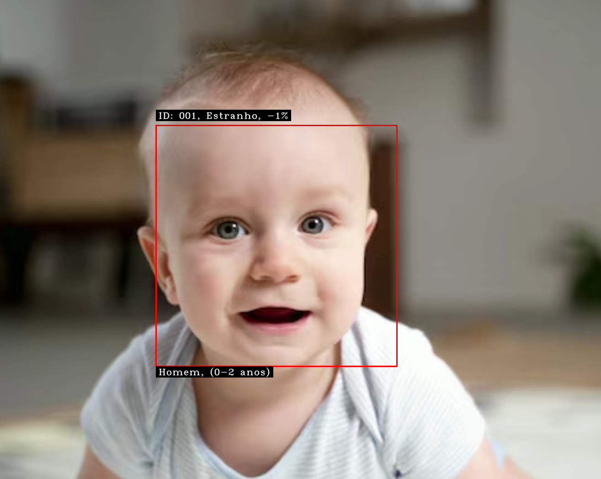
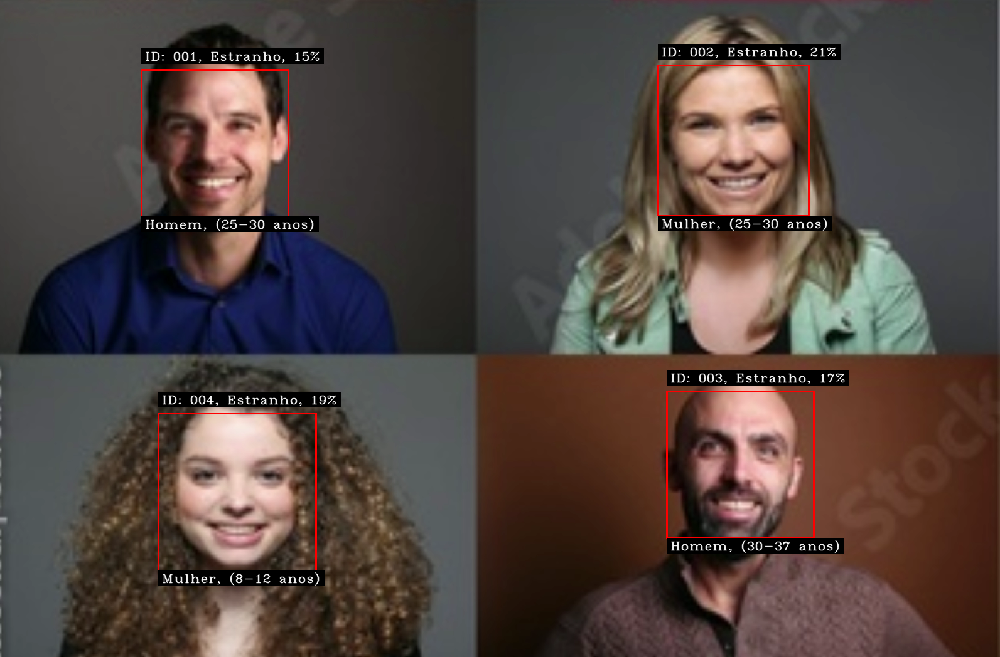

# FaceScanId

## Projeto de Detecção e Reconhecimento Facial

Este projeto utiliza a biblioteca OpenCV em Python para criar um sistema completo de detecção e reconhecimento facial. Ele abrange desde a captura de imagens faciais até o treinamento de modelos de reconhecimento e a identificação em tempo real, incluindo previsões de gênero e idade.

Agora o projeto também conta com uma **interface gráfica intuitiva**, desenvolvida com **Tkinter**, disponível no `main.py`!

<p align="center">
    
</p>

---

## O que é Visão Computacional?

Visão Computacional é o campo da Inteligência Artificial que permite aos computadores interpretarem imagens e vídeos digitais de forma semelhante aos humanos. Essa tecnologia é aplicada para aquisição, processamento e análise de imagens, extraindo informações relevantes para tomada de decisões. Exemplos de aplicação incluem reconhecimento de objetos, rastreamento de movimento e restauração de imagens.

---

## Sobre o Projeto

Este projeto em Python emprega técnicas avançadas de Deep Learning para identificar o sexo e a idade de uma pessoa a partir de uma única imagem facial. Os modelos utilizados para previsão foram treinados por Tal Hassner e Gil Levi. O sistema prevê:

- **Gênero**: Masculino ou Feminino
- **Faixa Etária**: de (0–2 anos) até (60–100 anos)

<p align="center">
    
</p>

---

## Estrutura do Projeto

- **Interface Gráfica com Tkinter**: Controle fácil de todas as funções.
- **Captura de Imagens Faciais**: Coleta de imagens usando webcam.
- **Treinamento de Modelos**: Treinamento de reconhecimento facial usando LBPH.
- **Reconhecimento em Tempo Real**: Identificação de faces, gênero e idade durante a captura de vídeo.
- **Aprimoramento de Dados**: Cadastro e integração de rostos inicialmente desconhecidos.

---

## Arquivos Principais

| Arquivo           | Descrição |
| ----------------- | --------- |
| `main.py`          | Interface gráfica principal do sistema. |
| `cadastro.py`      | Captura de imagens faciais para cadastro. |
| `treinamento.py`   | Treinamento do modelo de reconhecimento facial. |
| `reconhecedor.py`  | Reconhecimento facial em tempo real com previsão de gênero e idade. |
| `aprimoramento.py` | Aprimoramento contínuo do banco de dados facial. |

---

## Instalação

1. **Crie um ambiente virtual**:
    ```bash
    python -m venv venv
    ```

2. **Ative o ambiente virtual**:
    ```bash
    source venv/bin/activate  # Linux/Mac
    venv\Scripts\activate     # Windows
    ```

3. **Instale as dependências**:
    ```bash
    pip install -r requirements.txt
    ```
    Ou instale manualmente:
    ```bash
    pip install numpy opencv-python colorama opencv-contrib-python Pillow
    ```

    **Observação**: Pode ser necessário instalar o `Tkinter`:
    ```bash
    sudo apt install python3-tk
    ```

---

## Como Usar

### 1. Interface Gráfica (`main.py`)

- Execute:
    ```bash
    python main.py
    ```
- Navegue pelas opções de cadastro, treinamento, reconhecimento e aprimoramento de forma intuitiva através da interface.

### 2. Modo Manual (Arquivos Individuais)

#### Captura de Imagens Faciais (`cadastro.py`)

- Execute:
    ```bash
    python cadastro.py
    ```
- Insira um **ID** e um **nome** quando solicitado.
- O sistema irá capturar automaticamente **70 imagens** do seu rosto e armazená-las no diretório `fotos/`.


#### Treinamento dos Modelos (`treinamento.py`)

- Execute:
    ```bash
    python treinamento.py
    ```
- As imagens serão usadas para treinar o classificador facial LBPH, que será salvo em `classifier/classificadorLBPH.yml`.

#### Reconhecimento em Tempo Real (`reconhecedor.py`)

- Execute:
    ```bash
    python reconhecedor.py
    ```
- O sistema reconhecerá rostos capturados pela webcam e exibirá:
  - ID
  - Nome
  - Gênero previsto
  - Faixa de idade prevista

> Se for uma pessoa desconhecida, o sistema atribuirá um ID automático começando com "00".

> Durante a execução, pressione **Enter** para capturar imagens de estranhos e armazená-las no diretório `estranhos/`.

<p align="center">
    
</p>

---

#### Aprimoramento de Dados (`aprimoramento.py`)

- Execute:
    ```bash
    python aprimoramento.py
    ```
- Insira o **ID existente** e o **nome** para cadastrar rostos de estranhos capturados anteriormente, pelo script `reconhecedor.py`

---

## Estrutura de Diretórios

```
projeto/
│
├── cascade/
│   ├── haarcascade_frontalface_default.xml
│   ├── haarcascade-eye.xml
│   └── haarcascade_frontalface_default.xml
│
├── classifier/
│   └── classificadorLBPH.yml
│
├── modelos/
│   ├── opencv_face_detector.pbtxt
│   ├── opencv_face_detector_uint8.pb
│   ├── age_deploy.prototxt
│   ├── age_net.caffemodel
│   ├── gender_deploy.prototxt
│   └── gender_net.caffemodel
│
├── fotos/
│   └── (imagens dos cadastrados)
│
├── estranho/
│   └── (imagens dos estranhos capturados)
│
└── scripts/
    ├── cadastro.py
    ├── treinamento.py
    ├── reconhecedor.py
    └── aprimoramento.py

```


## Parâmetros Ajustáveis

Este projeto permite ajustar vários parâmetros para atender às suas necessidades específicas. Abaixo estão os principais parâmetros que você pode configurar:

### Script `cadastro.py`

- **Número de Fotos Capturadas**: Define quantas fotos de rosto são capturadas por pessoa durante o processo de cadastro.

    ```python
    numMostras = 70  # Número de fotos capturadas por pessoa
    ```

    <div align="center">

    ### TABELA 
    | Amostras | Precisão |
    | :--------: | :-------- |
    | **30** | NADA PRECISO         |
    | **50** | POUCO PRECISO        |
    | **70** | MEDIO PRECISO        |
    | **90** | MUITO PRECISO        |
    | **100** |  EXTREMAMENTE PRECISO|

    </div>

    - Um maior número de fotos e um algoritmo mais refinado resultarão em um melhor reconhecimento dos rostos cadastrados. Quanto mais imagens forem fornecidas ao modelo, melhor ele se tornará. Recomendo, para uma boa detecção, no mínimo 70 imagens; para uma excelente detecção, 100 imagens.

### Script `reconhecedor.py`

- **Escala da Janela de Detecção (`scaleFactor`)**: Controla a taxa de escala pela qual a imagem é reduzida em cada nível da pirâmide de imagem durante a detecção de rostos.

    ```python
    scaleFactor = 1.3  # Escala da janela de detecção
    ```

    - **Resumo**: O `scaleFactor` afeta a sensibilidade da detecção de rostos. Valores mais altos tornam o sistema menos sensível a rostos pequenos ou distantes, o que pode melhorar o desempenho, reduzindo falsas detecções. Valores mais baixos aumentam a sensibilidade, permitindo detectar rostos menores ou distantes, mas aumentando o tempo de processamento.

- **Número de Vizinhos (`minNeighbors`)**: Define quantos vizinhos cada candidato a retângulo de detecção deve ter para ser considerado como um rosto válido.

    ```python
    minNeighbors = 5  # Número de vizinhos
    ```

    - **Resumo**: O `minNeighbors` influencia diretamente na precisão da detecção de rostos. Valores mais altos reduzem o número de detecções falsas ao exigir uma confirmação maior de vizinhos para cada detecção. Valores mais baixos aumentam o número de detecções, o que pode ser útil para detectar rostos menos distintos, mas aumenta o risco de falsas detecções.

- **Limiar de Confiança (`limiar_confianca`)**: Define o limite de confiança para reconhecer um rosto como correspondente a um usuário cadastrado.

    ```python
    limiar_confianca = 65  # Limiar de confiança
    ```
    
    <div align="center">

    ### TABELA

    | **Valor** | **Confiança**           |
    | :-----------------: | :------------------ |
    | **30**                 | Extremamente Preciso |
    | **40**                 | Muito Preciso        |
    | **50**                 | Médio Preciso        |
    | **60**                 | Pouco Preciso        |
    | **70**                 | Nada Preciso         |

    </div>

    - **Resumo**: O `limiar_confianca` determina quão seguro o sistema deve estar para reconhecer um rosto como correspondente a um usuário cadastrado. Ajustar esse valor afeta diretamente a precisão do reconhecimento facial e pode ajudar a controlar o número de falsas identificações.

Esses ajustes permitem personalizar o comportamento do projeto conforme suas preferências e necessidades específicas. Para mais detalhes, consulte os comentários no código de cada script.

---

## Construído Com

* [OpenCV](https://pypi.org/project/opencv-contrib-python/) - OpenCV
* [NumPy](https://numpy.org/) - NumPy
* [Python](https://www.python.org/) - Python
* [Colorama](https://pypi.org/project/colorama/) - Colorama

* e outros

## Autor

**Lukas** - [lukas.py](https://github.com/lukas8484)

---

## Contribuições

Contribuições são bem-vindas! Sinta-se à vontade para enviar pull requests ou relatar problemas.

---
## Créditos

**Detecção de Gênero e Idade** baseada em modelos treinados por Tal Hassner e Gil Levi.

**Reconhecimento Facial** baseado na técnica LBPH do OpenCV.

---

## Licença

Este projeto está licenciado sob a MIT License.

---


